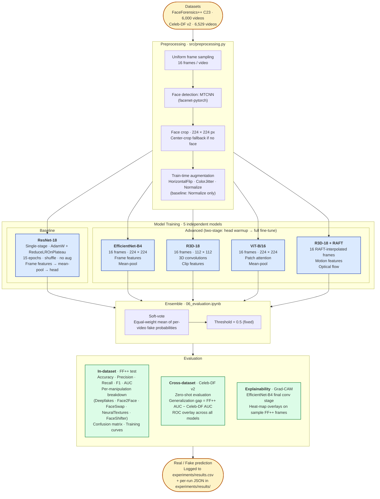

# Project Architecture

End-to-end pipeline for binary deepfake detection: raw videos → preprocessing → five independently-trained models → ensemble → cross-dataset evaluation → explainability.

## Notes

- **Experiment tracking**: every training and evaluation run appends a row to `experiments/results.csv` and writes a per-run JSON payload to `experiments/results/<run_id>.json`. The CSV is the leaderboard; the JSON is the full provenance record (config, training history, per-manipulation metrics, checkpoint path).

- **Device priority**: all model and training code uses `src.training.pick_device()` which resolves `cuda → mps → cpu`. The same notebooks run on Google Colab Pro (CUDA) and on local Apple Silicon (MPS) without changes.

- **R3D-18 + RAFT**: the interpolation step requires CUDA (MPS is unsupported for `torchvision.models.optical_flow.raft`). Known issues in the current interpolation math are documented in the `extract_face_frames_interpolated` docstring in `src/preprocessing.py`.

- **Baseline vs advanced training recipes differ deliberately**. ResNet-18 uses single-stage AdamW + `ReduceLROnPlateau` with no augmentation — this matches the historical recipe that produced the repo's reference numbers. The four advanced models use two-stage (head warmup → full fine-tune) with `WeightedRandomSampler` and train-time augmentation. Evaluation is identical across all five models, so leaderboard comparisons are apples-to-apples at eval time even though training dynamics differ.
