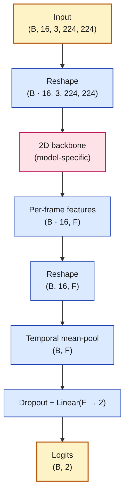
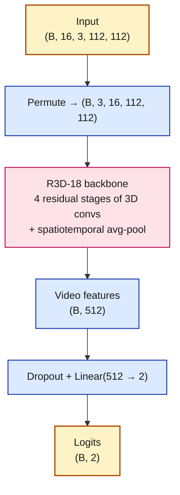

# Model Architectures

Layer-level view of each of the five models, plus the equations that govern training and evaluation. This complements `solution_architecture.md`, which shows the overall pipeline.

## Summary table

| # | Model | Input shape | Backbone | Feature dim | Temporal aggregation | Head |
|---|---|---|---|---|---|---|
| 1 | ResNet-18 (baseline) | (B, 16, 3, 224, 224) | 4 residual stages | 512 | mean across 16 frames | Dropout(0.3) + Linear(512 → 2) |
| 2 | EfficientNet-B4 | (B, 16, 3, 224, 224) | 7 MBConv + SE stages | 1792 | mean across 16 frames | Dropout(0.3) + Linear(1792 → 2) |
| 3 | R3D-18 | (B, 16, 3, 112, 112) | 3D residual stages | 512 | built-in spatiotemporal pool | Dropout(0.3) + Linear(512 → 2) |
| 4 | ViT-B/16 | (B, 16, 3, 224, 224) | 12 transformer blocks, 14×14 patches | 768 | mean across 16 frames | Dropout(0.2) + Linear(768 → 2) |
| 5 | R3D-18 + RAFT | (B, 16, 3, 112, 112) | same as R3D-18 + RAFT-interpolated input | 512 | built-in spatiotemporal pool | Dropout(0.3) + Linear(512 → 2) |

**Common pattern.** All five end in `Dropout → Linear(F → 2)` producing binary logits. The difference lies in the backbone and the feature-aggregation strategy (per-frame + mean-pool vs. clip-level 3D convs).

---

## Shared pattern — per-frame 2D models (ResNet-18, EfficientNet-B4, ViT-B/16)

**Per-model backbone specifics:**

- **ResNet-18** — `conv7×7 → maxpool → 4 residual stages (each 2 BasicBlocks) → global avg-pool`. Final feature dim F = 512. Weights: ImageNet pretrained.
- **EfficientNet-B4** — `stem 3×3 conv → 7 MBConv stages with squeeze-excitation → global avg-pool`. Final feature dim F = 1792. Compound scaling (α, β, γ) over depth, width, resolution.
- **ViT-B/16** — `patch embedding (14 × 14 patches, 16 px each) + position embedding + [CLS] token → 12 transformer encoder blocks (MSA + MLP) → [CLS] hidden state`. Final feature dim F = 768. Uses scaled dot-product attention.

---

## Shared pattern — clip-level 3D models (R3D-18, R3D-18 + RAFT)

**R3D-18 vs R3D-18+RAFT:**

- **R3D-18** — feed 16 uniformly sampled native frames directly into the 3D CNN. Kinetics-400 pretrained weights.
- **R3D-18 + RAFT** — preprocess 8 native frames, compute RAFT optical flow between each adjacent pair, synthesise 8 intermediate (motion-aware) frames, interleave to produce 16. Feed the 16 interpolated frames into the identical R3D-18 architecture. Intended to give the model explicit motion cues that temporally sparse sampling misses.

---

## Training objective

**Class-weighted binary cross-entropy.** For a batch of N videos with binary targets $y_i \in \{0, 1\}$ and predicted fake-probabilities $p_i$:

$$L \;=\; -\frac{1}{N} \sum_{i=1}^{N} \left[ w_1 \cdot y_i \log p_i \;+\; w_0 \cdot (1 - y_i) \log (1 - p_i) \right]$$

Class weights are computed from inverse frequency on the training split:

$$w_c \;=\; \frac{N_{\text{train}}}{2 \, N_c} \qquad \text{for } c \in \{0, 1\}$$

This up-weights the minority class (real videos, ~1:5 imbalance in FF++) so the loss doesn't collapse to predicting "fake" for everything.

**Softmax head.** Binary logits $z \in \mathbb{R}^2$ are converted to probabilities via softmax:

$$p_c \;=\; \frac{\exp(z_c)}{\exp(z_0) + \exp(z_1)} \qquad \text{and we report } p_1 \text{ as the "fake" probability.}$$

**Temporal mean-pooling.** For 2D-CNN models, per-frame features $f_\theta(x_t) \in \mathbb{R}^F$ are averaged across the 16 frames to produce a single video vector:

$$v_{\text{video}} \;=\; \frac{1}{T} \sum_{t=1}^{T} f_\theta(x_t), \qquad T = 16$$

**Optimizers.**

- *Baseline (ResNet-18):* AdamW with $\text{lr}=10^{-4}$, weight decay $10^{-4}$. `ReduceLROnPlateau` halves the LR when val F1 plateaus for 3 epochs: $\text{lr}_{t+1} = 0.5 \cdot \text{lr}_t$.
- *Advanced models:* Adam with two-stage training. Stage 1 freezes the backbone and trains only the head at $\text{lr}=10^{-3}$ for 3 epochs. Stage 2 unfreezes and fine-tunes the full network at $\text{lr}=10^{-4}$ for 10 epochs.

---

## Evaluation metrics

**Accuracy, Precision, Recall, F1.** Standard confusion-matrix-based metrics:

$$\text{Accuracy} = \frac{\text{TP} + \text{TN}}{\text{TP} + \text{TN} + \text{FP} + \text{FN}} \qquad F_1 = 2 \cdot \frac{P \cdot R}{P + R}$$

**AUC-ROC.** Area under the ROC curve, computed over the continuous `fake-probability` $p_i$ rather than the thresholded prediction. Threshold-free; best for comparing models regardless of decision-boundary choice.

**Per-manipulation breakdown.** FF++ test set contains five fake classes (Deepfakes, Face2Face, FaceSwap, NeuralTextures, FaceShifter). For each manipulation $m$, we compute AUC / F1 on the subset of videos where `source_class == m` combined with all real videos. This reveals which manipulations a given model struggles with.

**Generalization gap** (cross-dataset transfer):

$$\Delta_{\text{gen}} \;=\; \text{AUC}_{\text{FF++ test}} \;-\; \text{AUC}_{\text{Celeb-DF v2 test}}$$

A small $\Delta_{\text{gen}}$ means the detector generalises; a large gap means it's overfitting FF++-specific artifacts.

---

## Ensemble

**Soft-vote** over the M = 5 trained models. For a given test video $x$, each model $m$ produces a fake-probability $p_m(\text{fake} \mid x)$, and the ensemble score is the unweighted mean:

$$p_{\text{ens}}(\text{fake} \mid x) \;=\; \frac{1}{M} \sum_{m=1}^{M} p_m(\text{fake} \mid x)$$

The final decision uses a fixed threshold of 0.5:

$$\hat{y}_{\text{ens}} \;=\; \mathbb{1}\!\left[\, p_{\text{ens}}(\text{fake} \mid x) > 0.5 \,\right]$$

(A future improvement would be to sweep thresholds on the val set and pick argmax-F1, rather than hardcoding 0.5.)

---

## Grad-CAM for interpretability

For a trained classifier with a convolutional backbone, Grad-CAM produces a heat-map showing which input regions most influence the "fake" logit. For a target class $c$ and feature map $A^k$ (k-th channel of a chosen conv layer), the class-activation score at spatial position $(i, j)$ is:

$$\alpha_k^c \;=\; \frac{1}{Z} \sum_{i,j} \frac{\partial y^c}{\partial A^k_{i,j}} \qquad L^c_{\text{Grad-CAM}} \;=\; \text{ReLU}\!\left( \sum_k \alpha_k^c \, A^k \right)$$

For this project, `06_evaluation.ipynb` applies Grad-CAM to EfficientNet-B4's final MBConv stage — a common choice because it preserves spatial resolution while carrying enough semantic signal to highlight which face regions drove the classification.
