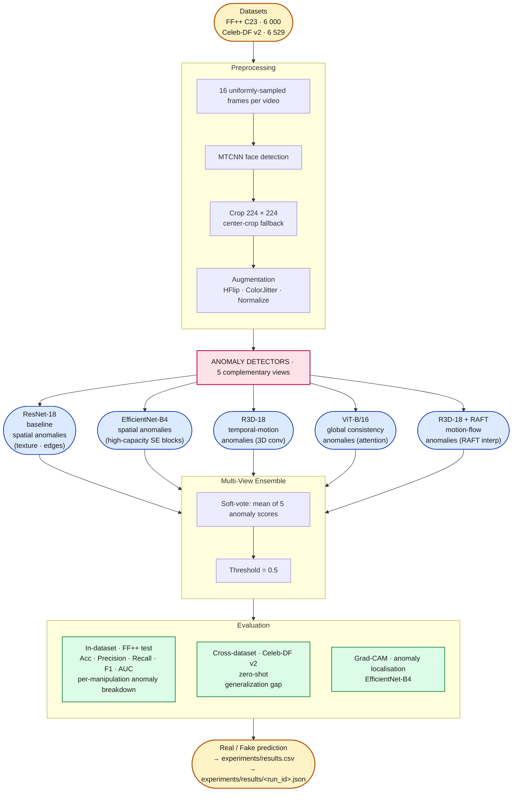

# Solution Architecture

End-to-end workflow from raw video to real/fake prediction, framed as multi-view anomaly detection. Each model targets a different class of deepfake anomaly; the ensemble aggregates their predictions into a single soft-vote score.

## Key notes

- **Anomaly detection framing.** Real faces occupy a learnable manifold; every deepfake manipulation introduces deviations from it. Each of the five models learns a *different class* of anomaly signature. The ensemble aggregates these complementary views.

| Model | Anomaly class targeted | Architectural mechanism |
|---|---|---|
| ResNet-18 | Spatial (local texture, edges) | 4 residual stages with 2D convs |
| EfficientNet-B4 | Spatial (high-capacity) | 7 MBConv stages with squeeze-excitation |
| R3D-18 | Temporal-motion | 3D convolutions over (T, H, W) |
| ViT-B/16 | Global consistency | Self-attention over 14 × 14 patches |
| R3D-18 + RAFT | Motion-flow | 3D convs on RAFT-interpolated frames |

- **Ensemble as multi-view anomaly detector.** Because the five detectors operate on different feature classes, their errors are partially decorrelated. A deepfake that evades per-frame detection by matching natural texture statistics may still be caught by the 3D-conv model because its motion is off, and vice versa.
- **Parallel, not sequential.** Each model trains and predicts independently on the same preprocessed data. No model ever sees another model's weights or intermediate features.
- **Device priority** is `cuda → mps → cpu` via `src.training.pick_device()`. Same notebooks run unchanged on Colab (A100/L4) and local Apple Silicon (MPS).
- **Experiment tracking**: every run writes a row to `experiments/results.csv` (leaderboard) and a JSON file to `experiments/results/` (full provenance).
