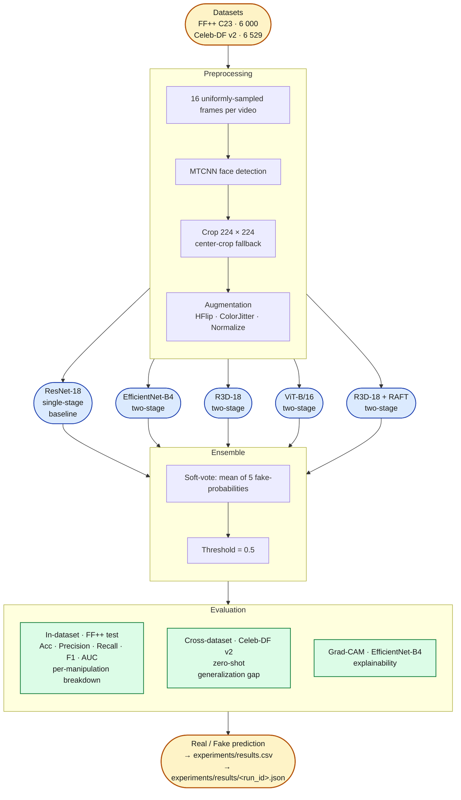

# Solution Architecture

End-to-end workflow from raw video to real/fake prediction. This is the "how the system is wired together" view — see `model_architectures.md` for layer-level detail and equations.

## Key notes

- **Parallel, not sequential.** Each model trains and predicts independently on the same preprocessed data. No model ever sees another model's weights or intermediate features. The ensemble combines **predictions only**.
- **Baseline vs advanced** have deliberately different training recipes; evaluation is identical across all five so the leaderboard comparison is apples-to-apples.
- **Device priority** is `cuda → mps → cpu` via `src.training.pick_device()`, so the same notebooks run unchanged on Colab (A100) and local Apple Silicon (MPS).
- **Experiment tracking**: every run writes a row to `experiments/results.csv` (leaderboard) and a JSON file to `experiments/results/` (full provenance).
